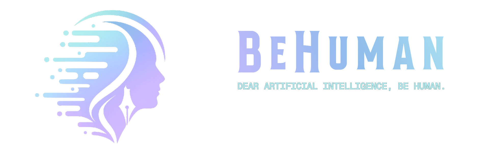

<div align="center">

**BeHuman is a writing skill that strips AI "tells" out of generated text and puts a real voice back in.**
<br>


<br>


</div>

---

## What is BeHuman?

BeHuman is an [Agent Skill](https://github.com/anthropics/skills) — a `SKILL.md` plus a handful of reference files — that rewrites AI-generated text so it reads like a person wrote it. It doesn't just strip obvious tells like em dashes and "Certainly!". It reconstructs the writing: voice calibration before drafting, a line-level pattern scan, and three ordered self-critique passes afterward.

Internally the project frames this around the **Penta-State Probabilistic Model (PSPM)** — a five-state scale (True / Partially True / Undecided / Partially False / False) for how confidently a piece of text reads as human-written. PSPM is optional and off by default; see [Known limitations](#known-limitations) for where it currently stands.

**New in 0.3.0:** Lexical Surprise was reworked around the Oxford 5000 word list (shipped locally as `ext/words.csv`) after the previous version was shown to break set idioms and phrases when hunting for a "better" word. See `changelog.md` for the full list if you want it (just ask, since the skill won't open it on its own now).

## Features

- **Pattern removal** — AI-writing tells across five documented categories in `pattern.md` (content, language & grammar, style, communication, filler & hedging), building on the pattern catalogue from [Wikipedia: Signs of AI writing](https://en.wikipedia.org/wiki/Wikipedia:Signs_of_AI_writing). Citation-specific patterns live separately in `writing-thinking/formal.md`, since conversational writing doesn't need them.
- **Voice calibration before drafting** — `pre-pass.md` sets personality, dialect, and writing-sample matching *before* anything gets written, not as a check run on a finished draft. Hand it a writing sample and it matches your sentence length, word choice, and punctuation habits; without one, it aims for a strong, confident default rather than guessing at something exotic or copying a poor sample's weaknesses.
- **Dialect handling** — defaults to British English when there's no signal to go on, and reads context (or the conversation itself) to switch to American, Australian, or another regional dialect.
- **Three ordered post-passes** — `post-pass.md` runs Burstiness Calibration, then Lexical Surprise, then Perplexity Audit, strictly in that order, because each pass depends on the previous one having settled first (restructuring a sentence for burstiness changes which words end up next to each other, so word choice has to wait until structure is fixed; word choice has to be settled before you can judge which sentences are still the most predictable overall).
- **Register-specific guidance** — `writing-thinking/formal.md` covers formal/technical writing in full. `writing-thinking/learning.md` (explanatory writing) and `writing-thinking/conversational.md` (the default fallback) both have their trigger conditions defined but are thin on actual guidance content right now (see [Known limitations](#known-limitations)).
- **PSPM confidence read-out** — an optional closing label (e.g. "High confidence that it is human-written"), scored against `PSPM.md`'s formulas and the 17-question checklist in `EVIDENCE.md`. Off unless you ask for it.

## How it works

1. Read the input, and the writing sample if one's provided.
2. Work through `pre-pass.md` — personality, dialect, sample-matching — before drafting anything.
3. Write the draft, then scan it against `pattern.md` and the relevant `writing-thinking/` file.
4. Run `post-pass.md`, in its required order: Burstiness Calibration → Lexical Surprise → Perplexity Audit.
5. Present the final rewrite, with an optional summary of changes and a PSPM read if asked.

## Installation

No dependencies, no build step — it's a folder. Where it goes depends on the surface:

|                                   Surface     | Location                                                                                              |
|-----------------------------------------------|-------------------------------------------------------------------------------------------------------|
| **Claude Code** — personal (all projects)     | `~/.claude/skills/behuman/`                                                                           |
| **Claude Code** — project (shared via git)    | `.claude/skills/behuman/` at the repo root                                                            |
| **Claude Desktop**                            | Same as Claude Code: `~/.claude/skills/behuman/`                                                      |
| **claude.ai**                                 | Settings → Features → upload the folder as a `.zip`                                                   |
| **Claude API**                                | Upload via the [Skills API](https://docs.claude.com) (`/v1/skills`) — shared workspace-wide           |
| **OpenCode / other agents**                   | It's a plain `SKILL.md` folder — check that tool's own skill-loading docs for where custom skills go  |

```bash
# Claude Code, personal skill, latest release
curl -L -o behuman.zip https://github.com/w3nabil/behuman/releases/download/0.3.0/behuman-0.3.0.zip
unzip behuman.zip -d ~/.claude/skills/
mv ~/.claude/skills/behuman-0.3.0 ~/.claude/skills/behuman
```

Front matter declares `allowed-tools: Read, Write, Edit, Grep, Glob, AskUserQuestion, DeepResearch` — grant those if your setup asks.

## Usage

Just ask, in plain language:

> "Remove the AI-signs from this [paste text / file path]"
>
> "Imagine you are a human. Here's a sample of my writing for voice matching: [sample]. Now rewrite this: [text]"
>
> "Can you humanise this text? Use my writing style from [file] as a reference."

No sample needed. Without one, BeHuman aims for its strongest default voice rather than guessing at something exotic.

### Example (Conversational)

**Before:**
> Autism, also known as Autism Spectrum Disorder (ASD), is a neurodevelopmental condition that affects how individuals perceive, process, and interact with the world around them. People with autism may experience differences in communication, social interaction, sensory processing, and patterns of behavior. The condition exists on a spectrum, meaning that its characteristics and support needs can vary widely from one person to another. Some autistic individuals may require substantial daily support, while others live independently and excel in academic, professional, or creative fields. Researchers believe that autism arises from a combination of genetic and environmental factors, although its exact causes are not fully understood. Increased awareness and acceptance have helped promote more inclusive educational, workplace, and community environments that recognize the strengths and diverse experiences of autistic people.

**After:**
> Autism, or Autism Spectrum Disorder, changes how a person takes in and responds to the world. That can show up in how they communicate, how they read social situations, how their senses handle things like noise or light, and in behaviours that repeat or feel comforting. It's called a spectrum for a reason: two autistic people can look nothing alike. One might need help with basic daily tasks. Another might run a company, publish research, or paint for a living, and nobody around them would guess. Where it comes from is still a genuinely open question. Genes clearly matter, and something in the environment probably plays a part too, but researchers haven't nailed down the full picture, and I'd be cautious of anyone who claims they have. What's changed is how people respond to it. Schools, workplaces, and ordinary communities are getting better, slowly, at making room for autistic people instead of expecting them to mask or adapt on their own. Progress is patchy, and it depends a lot on where you happen to live, but it's moving.

## File structure

```bash
behuman/
├── SKILL.md            # Core instructions and process — read on every run
├── pattern.md          # AI-pattern catalogue (5 categories) — read on every run
├── pre-pass.md         # Voice calibration, read before drafting — read on every run
├── post-pass.md        # Burstiness, lexical surprise, perplexity — read on every run
├── PSPM.md             # PSPM formulas and scoring procedure — optional, ask for it
├── EVIDENCE.md         # 17-question checklist PSPM scores against — optional, ask for it
├── readme.md           # This file — not read unless you name it
├── changelog.md        # Version history — not read unless you name it
├── credits.md          # Sources used to build the skill — not read unless you name it
├── WARP.md             # Context for Warp's agent when editing this repo — not read unless you name it
├── ext/                # words.csv (Oxford 5000) and media assets
└── writing-thinking/   # Register-specific notes: conversational, formal, learning
```

## Known limitations

A showcase shouldn't hide the rough edges, so here's where things stand honestly:

- **PSPM's confidence score is experimental.** A term it depends on ("accuracy threshold") isn't defined anywhere in the current files, one of its sub-calculations (Undecided Aspect Ratios) isn't actually read by the final formula, and the tie-breaking rule for the strong-evidence checklist can discard the partial-evidence signal entirely rather than weighing it in. Treat the PSPM label as a qualitative flourish for now rather than a precise metric — the pattern-removal and pre-pass/post-pass work is what's doing the real lifting on output quality.
- **`writing-thinking/conversational.md` and `writing-thinking/learning.md` are both thin on actual content.** Each has a working gating rule (when to use the file) and trigger examples, but `learning.md` has no writing-guidance section at all, and `conversational.md` sets up one heading ("Tone Rework") and cuts off mid-sentence with nothing under it. Only `formal.md` is fully built out. Since conversational is the *default* fallback register, this is the more consequential of the two gaps — most rewrites are quietly relying on a file that isn't carrying its weight yet.
- **`SKILL.md`'s front-matter `version:` field currently reads `0.2.5`**, out of step with this readme, the changelog, and the release tag (all `0.3.0`). Worth fixing on the next edit to `SKILL.md`; flagged here rather than silently changed so the author can confirm which number is correct.
- **PSPM's theoretical basis is a preprint**, not yet a peer-reviewed or independently validated method — worth treating accordingly until that changes.

## Support the Project

Testing every change properly (making sure a rewrite doesn't quietly break something else) uses real API tokens, and that adds up fast at any usage tier. That's the honest reason this section exists.

BeHuman is built and maintained outside of paid work, with no funding or involvement from any company or institution — just the author. It's free now and will stay free. If you ever see anyone selling a "paid version" or subscription for this project, that's not us — we don't offer one, and it's a scam. Please report it to us using the email provided below.

If it's useful to you, support in any form helps:

- **Money** — via bank transfer
- **Hardware or compute** — GPU/CPU time, cloud credits, or physical hardware
- **Software** — licenses, tooling, API access
- **Time** — testing, code review, documentation, or filing real failure cases as issues

Email [Nabil](mailto:w3nabil@gmail.com) for any of the above, including bank transfer details.

Worth noting: donors don't get any special privileges, just love and some flying kisses from the author.

---
